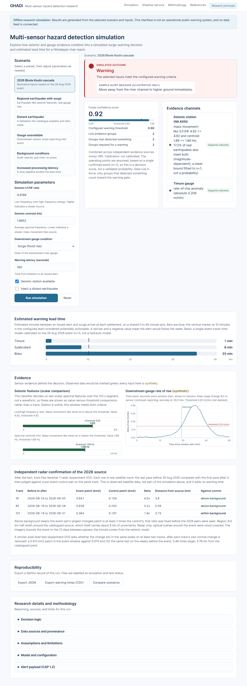
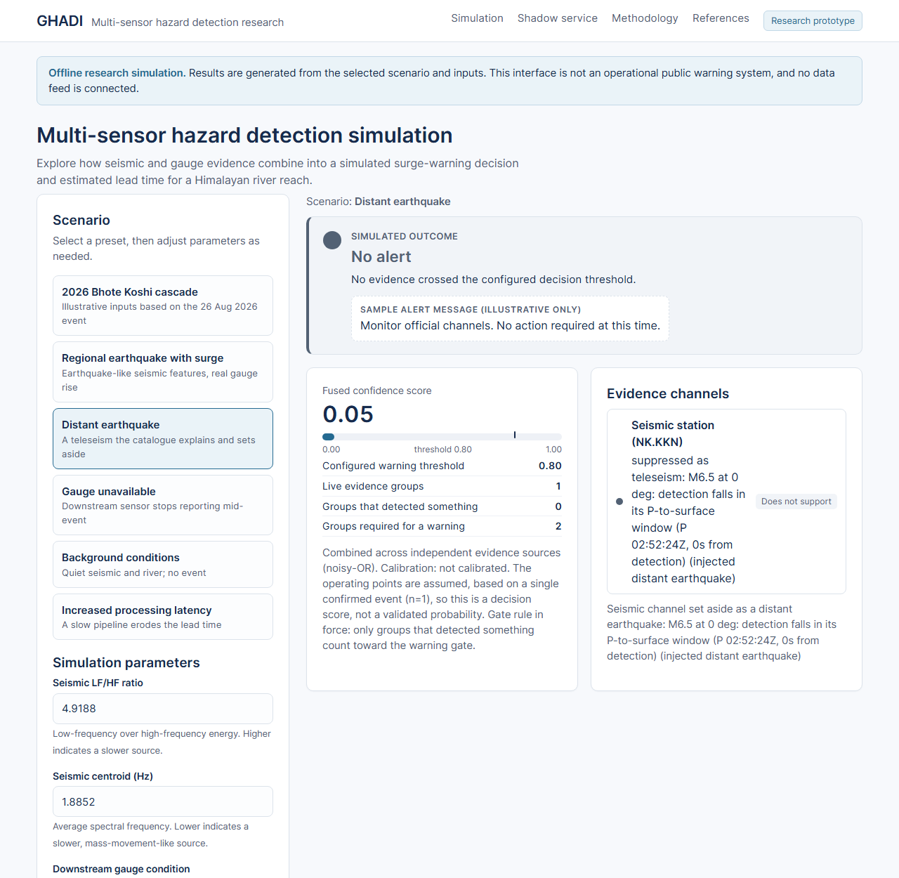
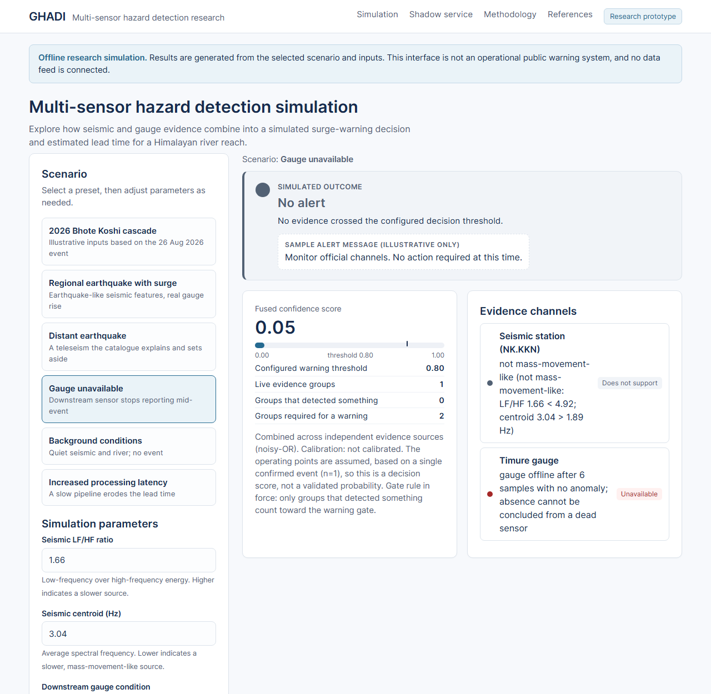
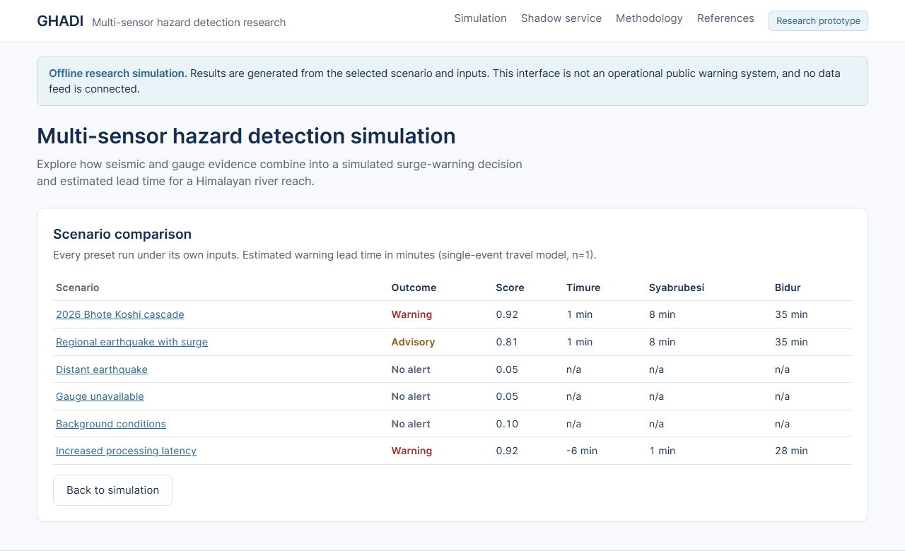
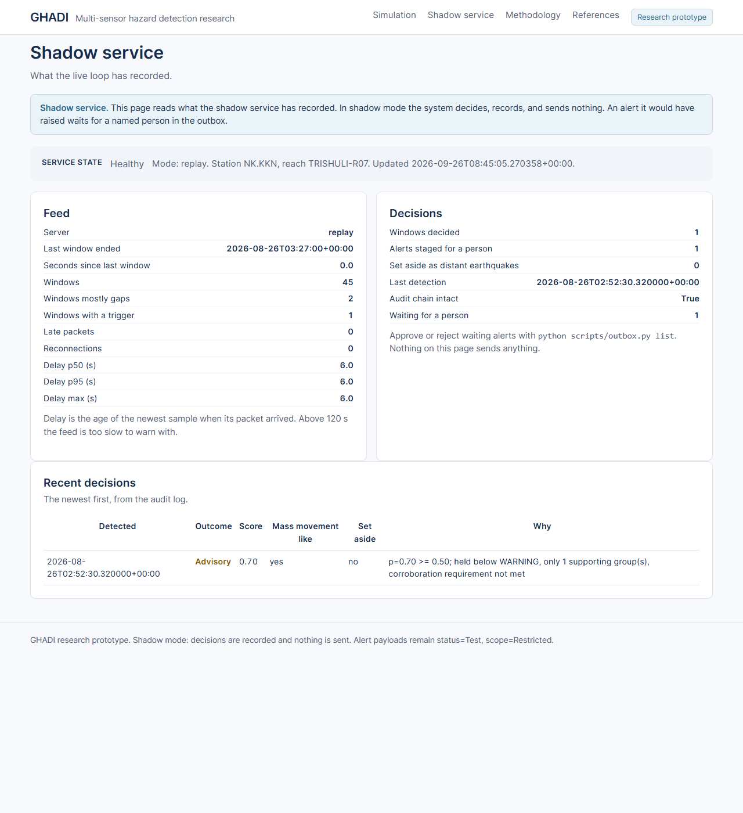

# GHADI

GHADI listens for the sound of a slope failing and tries to warn the villages downstream before the water reaches them.

The name घडी means "clock" or "watch". The whole point of the system is time.

## The idea

On 26 August 2026 a mass of ice and rock broke loose inside Tibet, blocked a small river, and then the block gave way. A wall of water raced down the Bhote Koshi and Trishuli rivers into Nepal and raised the river by about nine metres in thirty minutes. It was a dry day, so every flood system that watches for rain saw nothing. But the collapse itself made a strong ground signal, and an open seismic station recorded it minutes before the water arrived. Nobody was listening.

GHADI is built to listen. It does not try to predict when a slope will fail. It detects the failure as it happens, from open seismic data, confirms it against a downstream river gauge, and produces an alert.

Detection, not prediction.

## Try the dashboard

You can run the whole pipeline in your browser and try different situations. It runs fully offline and connects to no live feed. Nothing it shows is a real alert.

Start it:

```bash
uv run python scripts/serve.py
```

Then open http://localhost:8770 in your browser.



The picture above shows the main case. The inputs from the 2026 event produce a **Warning**. Two independent sources agree, the seismic station and the Timure gauge, the fused score is 0.92, and the estimated warning time is about 1 and a half minutes for Timure, 8 minutes for Syabrubesi, and 35 minutes for Bidur. These use the decision time the live path measured, about 160 seconds from the slope failing to a decision. Below the result you can see the evidence, the warning times on a shared scale, and the full method.

### A distant earthquake is set aside

A far away earthquake can look like a slow local source, because the signal loses its high notes over a long distance. GHADI checks a global earthquake list and sets those cases aside. Here the seismic station is online, but its signal is set aside as a distant earthquake. It gives no support, and there is no alert.



### A gauge that stops reporting

In 2026 four of five gauges were destroyed by the water. A dead gauge is not treated as a calm river. If a gauge stops before it reports a rise, its channel is marked unavailable, not safe. In this picture the seismic station is online and quiet, the gauge is marked unavailable, and there is no alert.



### Compare every scenario at once

Each preset runs under its own inputs, so you can see the outcomes side by side.

A Warning needs two separate sources that each detected something. A sensor that is switched on but quiet does not count. So in the regional earthquake case, where only the gauge sees a surge, the result is an Advisory and not a Warning. We chose this rule after testing both, because under the old rule switching on a quiet sensor could raise the alert.



### The shadow service

The same detector can now run on a live feed. In shadow mode it decides on every window, writes each decision to a log whose lines are chained by hash, and sends nothing. Every alert it would have raised waits for a named person, who approves or rejects it by name. The page below reads what the service has recorded. Here it shows the 2026 event replayed through the live path: one Advisory, staged for a person, from the seismic station alone.



To try it on your own machine, replay the 2026 event from the local cache:

```bash
python scripts/run_shadow.py replay --start 2026-08-26T02:42:10Z --minutes 45
```

Then see what is waiting for a person:

```bash
python scripts/outbox.py list
```

For a real feed, `docs/RUNBOOK.md` explains how to run it for a season and what each failure looks like.

### Independent confirmation from radar imagery

Satellites cannot give warning time. A free radar satellite passes over a spot only every 12 days, and cloud hides the ground for weeks in the monsoon, so no orbit can see a slope fail and tell a village in minutes. But radar sees through cloud, and it can confirm, after the fact, where the ground changed.

We compared the last radar pass before 26 August 2026 with the first pass after it, on each of the three satellite tracks that cover the source zone, and judged each one against a pair from before the event on the same track. On two of the three tracks the changed patch is 3.3 and 4.0 times larger than the normal change on that ground, above a floor of 2.0 that was fixed before we looked. The third track sits just under, at 1.85. All three tracks put their largest patch in the same small area, about 3 km across, 4 to 6 km north of the catalogued source point and inside its stated uncertainty.

A stricter test asks whether the change sits in the same pixels on every track, after each track's own normal change is removed. For 2026 it finds a patch of 0.41 square kilometres where at least two of the three tracks agree, which is 5.5 times the size of the same test run on the weeks before the event. No older event passes this test, and Thame comes closest at 2.4 times.

We then ran the same test on earlier weeks when nothing happened, and on the second radar channel. With all three tracks the 2026 patch is the largest of every earlier window we could compare fairly, and both radar channels find it within about 100 metres of each other. The honest limit is that only three such earlier windows exist, and on two tracks alone the event does not stand out. So it is a strong hint, not proof.

To get more fair comparisons we took the same late August weeks from 2022 to 2025. That gives 13 windows with all three tracks. The 2026 patch is still the largest, about 10 times the biggest of them, and it leads in the second radar channel too. With 13 windows the best possible rank is about 1 in 14, and 2026 reaches it. On two tracks alone it still does not stand out, because a spot near the river changed in late August of both 2022 and 2023. So the result needs all three tracks to agree.

We ran the same fair test on Thame, the 2024 glacial lake flood, which was the best older candidate. It does not pass. On all three tracks a monsoon window from 2022 has a bigger patch, and the spot that first made Thame look promising also changes in years when nothing happened. That does not mean the Thame flood did not happen. A flood that runs along an existing channel may change the radar picture much less than a slope collapse.

This is the first confirmation of the 2026 source that does not come from the seismic station. The same method did not cleanly confirm any of the older events in the catalogue. Spring snowmelt and peak monsoon produce so much natural change that those events are lost in it, so the positive class is still one event. The full record is in `experiments/exp012_satellite_confirmation`, and the dashboard shows it in its own panel below the evidence.

## What is honest about this

Please read this before you trust any number.

Good signs:

* The seismic signal from the 2026 event is clear on the open station at Kakani, and the station facts match the plan exactly.
* The same difference shows up on a second station 131 km away, so it is a property of the source and not a quirk of one site.
* A short real time test over SeedLink looks fast enough, about 16 seconds on average.

Hard limits, and they matter:

* There is only one confirmed event to learn from (n = 1). The confidence value is an assumed setting, not a tested probability.
* About 17 in every 100 real earthquakes look like the target on the two features, so the false alarm rate is still several times higher than the goal.
* On quiet days with no earthquakes the detector still raises false alarms. Measured on the short piece of signal it really decides on, Kakani gives about 14 a month and the Everest station about 89 a month. The goal is 1. Near Everest many of these may be real ice or rock falls that never became floods.
* The river gauge data needs an agreement with Nepal's hydrology office that is not yet in place, so the gauge data here is made up for testing.
* The live feed can be connected, but only in shadow mode. Nothing leaves the machine without a named person approving it. This is a research tool, not a working warning system.
* The time from a slope failing to a decision is about two and a half minutes, not the one minute the earlier lead times assumed. The decision needs two minutes of signal after the onset by design. So the nearest village, Timure, gets about one and a half minutes of warning, not three.
* Requiring both stations to see the same event at a fitting time cuts the false alarms a great deal, from about 89 to about 3 a month at Everest and from 14 to none at Kakani, but the second station was missing for a third of the cases. The gauge is still the only truly independent source, and it needs the data agreement.

Nothing here proves the core idea wrong. It does mean the real question, can these events be told apart at a rate people can trust, is still open.

## What is built

Every part of the chain exists and is tested. In plain words:

* **config**: every setting in one place.
* **catalog** and **fdsn**: read event lists and waveforms from open sources.
* **features**: measure the shape of the seismic signal.
* **detect**: find the moment a signal starts.
* **classify**: decide whether the seismic signal looks like a slope failure, using two simple measures against fixed thresholds.
* **hydro**: find a fast rise in a river gauge.
* **dhm**: clean raw gauge data into the tidy form the detector needs, and decide whether the sensor is still alive.
* **stream** and **sources**: turn a live packet feed, or a replayed one, into analysis windows, with gaps, delay, and late packets measured rather than hidden.
* **live**: run the detector on each window and hand the result to the service. Shadow mode only.
* **associate**: check whether two stations could be seeing one source, and where it could be.
* **delivery**: stage an alert for a person, record their approval, and only then deliver it to a file or an agreed endpoint. There is no public sink.
* **settings** and **health**: site settings from a file, and a health check for whoever runs it.
* **teleseism**: recognise a distant earthquake and set it aside.
* **fusion**: combine the sources into one tiered decision.
* **travel**: turn a detection into minutes of warning for each village.
* **cap** and **alerting**: write a standard alert message that carries the warning time.
* **service**: run the whole chain and keep a record that cannot be quietly changed.

See [docs/HANDOFF.md](docs/HANDOFF.md) for the full plan, [docs/RESEARCH_REPORT.md](docs/RESEARCH_REPORT.md) for the evidence, and [docs/EXPERIMENTS.md](docs/EXPERIMENTS.md) for the experiments.

## Run it yourself

You need Python 3.12 or newer and [uv](https://docs.astral.sh/uv/).

```bash
uv sync
uv run pytest
uv run ruff check .
uv run mypy src
```

Watch the whole chain run once on a 2026 style window, fully offline:

```bash
uv run python scripts/demo_pipeline.py
```

Open the dashboard:

```bash
uv run python scripts/serve.py
```

## Things this project will not do

* Predict earthquakes. That is not possible.
* Build another rain based flood model.
* Send public alerts on its own in the first version.
* Ask for new field hardware in the first phase.

## Repository notes

* The `main` branch is always green.
* Commits explain why, not what.
* Experiments never change once they are run. A new question gets a new folder.
* Negative results are kept, never deleted.
* Every time value is in UTC. Nepal time is UTC plus 5 hours 45 minutes.
* No text model ever writes a number. Templates only.
* An alert can never be marked Actual or Public unless the build is authorised. There is a test for this.

## Where things live

```
src/ghadi/    the package: config, catalog, fdsn, features, detect, classify,
              hydro, dhm, fusion, cap, travel, alerting, service
scripts/      the demo, the dashboard, and helper tools
data/         event definitions and the gitignored waveform cache
experiments/  one folder per question, each with its findings
tests/        the test suite, run with no network
docs/         the plan, the report, the experiments, and dashboard images
```

## Status

The software chain is complete and runs from end to end, offline. The parts still missing are not code. They are the live seismic feed, a data agreement for the river gauges, and more confirmed events to learn from.
